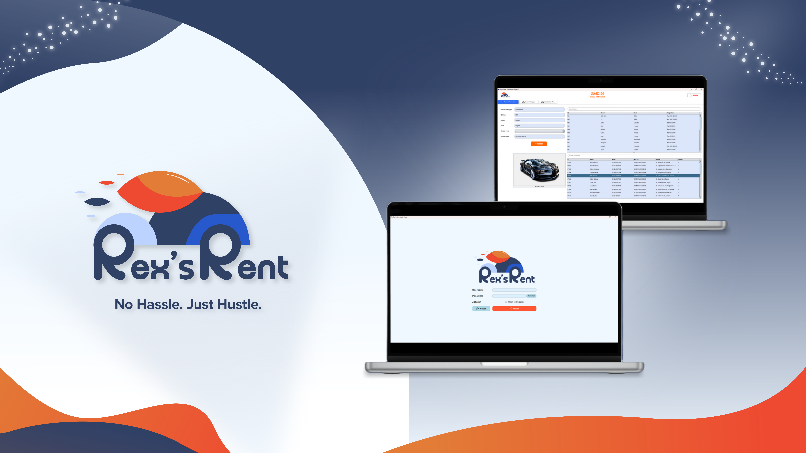

# Rex's Rents - Car Rental Management System

### Mockup

## Overview

Rex's Rents is a comprehensive car rental management system designed to streamline the operations of a car rental business. This project provides an intuitive graphical user interface (GUI) for both administrators and employees, enabling efficient management of cars, customers, transactions, and financial data. The system is built using Java Swing and incorporates database connectivity for data persistence.

> **Note:** This project is developed as part of a school assignment to demonstrate proficiency in Java programming, GUI design, and database integration.

---

## Features

### Admin Dashboard

- **Transaction History**: View and manage all rental transactions.
- **Car Management**: Add, update, and delete car records, including availability status and rental prices.
- **Employee Login Management**: Edit employee login credentials securely.
- **Financial Data**: Display financial statistics such as gross profit, net profit, and maintenance costs.
- **Statistics**: Visualize top-performing cars based on rentals and earnings.

### Employee Dashboard

- **New Transactions**: Add new rental transactions for customers.
- **Customer Management**: Manage customer data, including adding and updating records.
- **Car Returns**: Process car returns and calculate late fees dynamically.

---

## Technologies Used

- **Programming Language**: Java
- **GUI Framework**: Java Swing
- **Database**: MySQL
- **Font**: Custom "Poppins" font for enhanced UI aesthetics
- **Tools**: Visual Studio Code, JDBC for database connectivity

---

## Folder Structure

The project is organized as follows:

- **`src`**: Contains all source code files.
  - `AdminMenuBar.java`: Navigation bar for the admin dashboard.
  - `BaseDashboardUI.java`: Base class for shared dashboard components.
  - `DataKeuanganPanel.java`: Panel for displaying financial data.
  - `DataMobilPanel.java`: Panel for managing car data.
  - `DataPelangganPanel.java`: Panel for managing customer data.
  - `EditLoginPegawaiPanel.java`: Panel for editing employee login credentials.
  - `GUIAdmin.java`: Main class for the admin dashboard.
  - `GUIPegawai.java`: Main class for the employee dashboard.
  - `HistoryTransaksiPanel.java`: Panel for viewing transaction history.
  - `KembalikanMobilPanel.java`: Panel for processing car returns.
  - `Mobil.java`: Model class for car data.
  - `Pelanggan.java`: Model class for customer data.
  - `Utility.java`: Helper methods for styling and database connectivity.
- **`assets`**: Contains images and icons used in the application.
- **`lib`**: Contains external dependencies (if any).
- **`bin`**: Compiled output files (generated automatically).

---

## How to Run

1. **Set Up the Database**:

   - Import the provided SQL file into your MySQL database.
   - Update the database connection details in the `Utility.java` file.

2. **Compile and Run**:

   - Open the project in Visual Studio Code.
   - Use the `JAVA PROJECTS` view to build and run the application.

3. **Login**:
   - Use the default admin or employee credentials to log in.

---

## Screenshots

### Admin Dashboard

### Employee Dashboard

---

## Acknowledgments

This project is part of a school assignment and was developed to demonstrate:

- Proficiency in Java programming.
- GUI design using Java Swing.
- Database integration using JDBC.

Special thanks to our instructor for guidance and support throughout the development process.

---

## License

This project is for educational purposes only and is not intended for commercial use.
